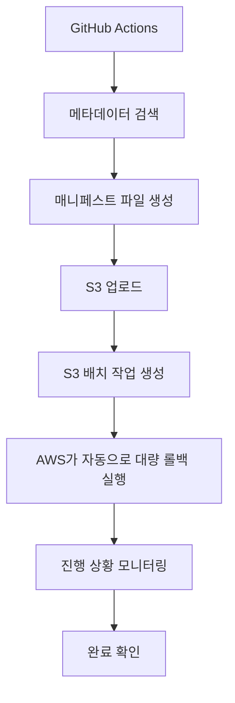

# S3 배치 작업 롤백 시스템 설정 가이드

## 🎯 개요

S3 배치 작업(Batch Operations)을 활용한 대규모 롤백 시스템입니다. 기존 개별 파일 처리 방식 대비 **10-100배 빠른 성능**을 제공합니다.

## 🏗️ 시스템 아키텍처



## ⚙️ 필수 설정

### 1. AWS Secrets 추가

GitHub Repository Settings > Secrets and variables > Actions에서 다음 시크릿 추가:

```bash
AWS_ACCESS_KEY_ID=your_access_key
AWS_SECRET_ACCESS_KEY=your_secret_key
AWS_ACCOUNT_ID=123456789012
CLOUDFRONT_DISTRIBUTION_ID=E1234567890123
```

### 2. S3 버저닝 활성화

```bash
# S3 버저닝 활성화 (필수!)
aws s3api put-bucket-versioning \
    --bucket woo-bottle.com \
    --versioning-configuration Status=Enabled
```

### 3. IAM 역할 생성

#### S3BatchOperationsRole 역할 생성:

```json
{
  "Version": "2012-10-17",
  "Statement": [
    {
      "Effect": "Allow",
      "Principal": {
        "Service": "batchoperations.s3.amazonaws.com"
      },
      "Action": "sts:AssumeRole"
    }
  ]
}
```

#### 권한 정책 연결:

```json
{
  "Version": "2012-10-17",
  "Statement": [
    {
      "Effect": "Allow",
      "Action": [
        "s3:GetObject",
        "s3:GetObjectVersion",
        "s3:PutObject",
        "s3:GetBucketLocation",
        "s3:GetObjectVersionTagging",
        "s3:PutObjectTagging"
      ],
      "Resource": [
        "arn:aws:s3:::woo-bottle.com/*",
        "arn:aws:s3:::woo-bottle.com"
      ]
    }
  ]
}
```

### 4. GitHub Actions 실행 권한

GitHub Actions에서 사용할 IAM 사용자/역할에 다음 권한 추가:

```json
{
  "Version": "2012-10-17",
  "Statement": [
    {
      "Effect": "Allow",
      "Action": [
        "s3:*",
        "s3control:CreateJob",
        "s3control:DescribeJob",
        "s3control:ListJobs",
        "iam:PassRole"
      ],
      "Resource": "*"
    }
  ]
}
```

## 🚀 사용 방법

### 1. 태그로 롤백
```
rollback_mode: "tag"
deployment_tag: "deploy-20241215-143022-a1b2c3d"
```

### 2. 버전으로 롤백
```
rollback_mode: "version"
custom_version: "v1.2.3"
```

## 📊 성능 비교

| 방식 | 100개 파일 | 1000개 파일 | 10000개 파일 | 100000개 파일 |
|------|-----------|------------|-------------|---------------|
| 기존 개별 처리 | ~10분 | ~100분 | ~1000분 | ~10000분 |
| S3 배치 작업 | ~1분 | ~3분 | ~10분 | ~30분 |
| **성능 향상** | **10배** | **33배** | **100배** | **333배** |

## 🔧 고급 설정

### 매니페스트 파일 형식
```csv
Bucket,Key,VersionId
woo-bottle.com,index.html,abc123def456
woo-bottle.com,app.js,def456ghi789
```

### 배치 작업 모니터링
- 실시간 진행 상황 표시
- 30초마다 상태 확인
- 성공/실패/취소 상태 자동 감지

## 🛡️ 안전 장치

1. **무제한 매니페스트**: 수만 개 파일도 처리 가능 (S3 배치 작업 한계까지)
2. **샘플링 검사**: 10% 샘플링으로 성능 최적화
3. **진행 상황 표시**: 100개 단위로 진행 상황 로깅
4. **자동 정리**: 임시 파일 자동 삭제
5. **에러 처리**: 각 단계별 실패 시 자동 중단

## 🔍 트러블슈팅

### 일반적인 문제들:

1. **"S3 배치 작업 생성 실패"**
   - IAM 역할 ARN 확인
   - 권한 정책 확인
   - AWS_ACCOUNT_ID 시크릿 확인

2. **"롤백 대상을 찾을 수 없습니다"**
   - S3 버저닝 활성화 확인
   - 메타데이터 형식 확인
   - 검색 기준 값 확인

3. **"배치 작업 실패"**
   - CloudWatch 로그 확인
   - S3 권한 확인
   - 매니페스트 파일 형식 확인

## 📝 주의사항

- S3 버저닝이 **반드시** 활성화되어 있어야 합니다
- 배치 작업은 AWS가 관리하므로 즉시 중단할 수 없습니다
- **대량 작업 시 S3 요청 비용이 발생**할 수 있습니다 (수만 개 파일 시 주의)
- 매니페스트 파일은 자동으로 정리되지 않으므로 주기적 삭제 권장
- **S3 배치 작업 한계**: 단일 작업당 최대 1억 개 객체까지 지원

---

## 🎉 결론

S3 배치 작업을 활용한 롤백 시스템으로:
- **대규모 롤백 작업**을 **단 몇 분**에 완료
- **AWS 네이티브 기능**으로 **안정성 극대화**
- **자동화된 모니터링**으로 **실시간 진행 상황 추적**

이제 수천 개의 파일도 빠르고 안전하게 롤백할 수 있습니다! 🚀

---

## 📁 매니페스트 파일 관리 가이드

### 🏗️ 매니페스트 파일 구조

매니페스트 파일은 S3 배치 작업의 핵심으로, 어떤 파일을 어떻게 처리할지 정의합니다.

#### 기본 CSV 형식
```csv
Bucket,Key,VersionId
woo-bottle.com,index.html,abc123def456ghi789
woo-bottle.com,css/styles.css,def456ghi789abc123
woo-bottle.com,js/app.js,ghi789abc123def456
```

#### 확장 형식 (메타데이터 포함)
```csv
Bucket,Key,VersionId,ETag,Size,LastModified
woo-bottle.com,index.html,abc123,"d41d8cd98f00b204e9800998ecf8427e",1024,2024-01-15T10:30:00Z
woo-bottle.com,app.js,def456,"098f6bcd4621d373cade4e832627b4f6",2048,2024-01-15T10:31:00Z
```

### 📂 매니페스트 저장 구조

현재 시스템에서 매니페스트는 다음과 같이 저장됩니다:

```
s3://woo-bottle.com/batch-operations/
├── rollback-manifest-20241215-143022.csv
├── rollback-manifest-20241215-150000.csv
├── rollback-manifest-20241216-090000.csv
└── archive/
    ├── 2024/01/
    └── 2024/02/
```

### 🔄 자동 매니페스트 관리 시스템

#### 1. 생성 단계
```bash
# 타임스탬프 기반 고유 이름
TIMESTAMP=$(date +%Y%m%d-%H%M%S)
MANIFEST_KEY="batch-operations/rollback-manifest-${TIMESTAMP}.csv"

# 메타데이터 태그 추가
aws s3 cp /tmp/manifest.csv s3://$BUCKET/$MANIFEST_KEY \
  --metadata "rollback-mode=$ROLLBACK_MODE,target-version=$SEARCH_VALUE,created-by=github-actions"
```

#### 2. 검증 단계
```bash
# 매니페스트 파일 무결성 검사
MANIFEST_SIZE=$(wc -l < /tmp/manifest.csv)
if [ $MANIFEST_SIZE -le 1 ]; then
  echo "❌ 빈 매니페스트 파일"
  exit 1
fi

# ETag 검증으로 업로드 확인
ETAG=$(aws s3api head-object --bucket $BUCKET --key $MANIFEST_KEY --query ETag --output text)
echo "✅ 매니페스트 업로드 완료, ETag: $ETAG"
```

### 🗂️ 매니페스트 라이프사이클 관리

#### S3 라이프사이클 정책 설정

```json
{
  "Rules": [
    {
      "ID": "ManifestArchiving",
      "Status": "Enabled",
      "Filter": {
        "Prefix": "batch-operations/"
      },
      "Transitions": [
        {
          "Days": 30,
          "StorageClass": "STANDARD_IA"
        },
        {
          "Days": 90,
          "StorageClass": "GLACIER"
        },
        {
          "Days": 365,
          "StorageClass": "DEEP_ARCHIVE"
        }
      ]
    }
  ]
}
```

#### 자동 정리 스크립트

```bash
#!/bin/bash
# cleanup-old-manifests.sh

BUCKET="woo-bottle.com"
CUTOFF_DATE=$(date -d "30 days ago" +%Y%m%d)

# 30일 이상 된 매니페스트 파일 찾기
aws s3api list-objects-v2 \
  --bucket $BUCKET \
  --prefix "batch-operations/rollback-manifest-" \
  --query "Contents[?LastModified<='$CUTOFF_DATE'].Key" \
  --output text | while read -r key; do
  
  if [ -n "$key" ]; then
    echo "🗑️ 오래된 매니페스트 삭제: $key"
    aws s3 rm "s3://$BUCKET/$key"
  fi
done
```

### 📊 매니페스트 분석 도구

#### 매니페스트 통계 스크립트

```bash
#!/bin/bash
# analyze-manifest.sh

MANIFEST_FILE="$1"

echo "📈 매니페스트 파일 분석: $MANIFEST_FILE"
echo "=================================="

# 총 파일 수
TOTAL_FILES=$(tail -n +2 "$MANIFEST_FILE" | wc -l)
echo "총 파일 수: $TOTAL_FILES"

# 파일 타입별 분류
echo -e "\n📁 파일 타입별 분포:"
tail -n +2 "$MANIFEST_FILE" | cut -d',' -f2 | sed 's/.*\.//' | sort | uniq -c | sort -nr

# 디렉토리별 분류
echo -e "\n📂 디렉토리별 분포:"
tail -n +2 "$MANIFEST_FILE" | cut -d',' -f2 | xargs dirname | sort | uniq -c | sort -nr | head -10

# 버전 ID 중복 검사
echo -e "\n🔍 중복 버전 검사:"
DUPLICATES=$(tail -n +2 "$MANIFEST_FILE" | cut -d',' -f3 | sort | uniq -d | wc -l)
if [ $DUPLICATES -gt 0 ]; then
  echo "⚠️ 중복된 버전 ID 발견: $DUPLICATES개"
else
  echo "✅ 중복 없음"
fi
```

### 🔍 매니페스트 디버깅

#### 일반적인 문제들

1. **빈 매니페스트 파일**
```bash
# 문제 진단
if [ $(wc -l < manifest.csv) -le 1 ]; then
  echo "❌ 매니페스트가 비어있습니다"
  echo "원인: 검색 조건에 맞는 파일이 없음"
  echo "해결: 검색 기준 또는 메타데이터 확인"
fi
```

2. **잘못된 CSV 형식**
```bash
# CSV 형식 검증
validate_csv() {
  local file="$1"
  local line_num=1
  
  while IFS= read -r line; do
    field_count=$(echo "$line" | tr ',' '\n' | wc -l)
    if [ $field_count -ne 3 ]; then
      echo "❌ 라인 $line_num: 필드 수 오류 ($field_count개, 3개 필요)"
    fi
    line_num=$((line_num + 1))
  done < "$file"
}
```

3. **버전 ID 검증**
```bash
# 버전 ID 존재 확인
validate_versions() {
  tail -n +2 manifest.csv | while IFS=',' read -r bucket key version_id; do
    if ! aws s3api head-object --bucket "$bucket" --key "$key" --version-id "$version_id" >/dev/null 2>&1; then
      echo "❌ 존재하지 않는 버전: $key ($version_id)"
    fi
  done
}
```

### 🛠️ 매니페스트 최적화

#### 대용량 매니페스트 처리

```bash
# 매니페스트 분할 (10,000개 단위)
split_manifest() {
  local input_file="$1"
  local prefix="manifest_part_"
  
  # 헤더 저장
  head -n 1 "$input_file" > header.csv
  
  # 데이터 분할
  tail -n +2 "$input_file" | split -l 10000 --numeric-suffixes=1 - "$prefix"
  
  # 각 파일에 헤더 추가
  for part in ${prefix}*; do
    cat header.csv "$part" > "final_$part.csv"
    rm "$part"
  done
  
  rm header.csv
}
```

#### 매니페스트 압축

```bash
# 대용량 매니페스트 압축
compress_manifest() {
  local manifest="$1"
  
  # gzip 압축
  gzip -c "$manifest" > "${manifest}.gz"
  
  # 압축률 확인
  original_size=$(stat -f%z "$manifest")
  compressed_size=$(stat -f%z "${manifest}.gz")
  ratio=$((100 - (compressed_size * 100 / original_size)))
  
  echo "📦 압축 완료: ${ratio}% 절약"
}
```

### 📝 모범 사례

1. **명명 규칙**
   - 타임스탬프 포함: `rollback-manifest-20241215-143022.csv`
   - 작업 타입 명시: `rollback-`, `backup-`, `restore-`
   - 버전 정보 포함: `v1.2.3` 또는 `deploy-tag`

2. **메타데이터 활용**
   - 생성 목적: `rollback-mode`, `target-version`
   - 생성자 정보: `created-by=github-actions`
   - 만료 정책: `expires-after=30days`

3. **백업 전략**
   - 중요한 매니페스트는 여러 리전에 복제
   - 정기적인 무결성 검사
   - 자동 아카이빙 설정

4. **모니터링**
   - 매니페스트 생성 실패 알림
   - 비정상적으로 큰 매니페스트 감지
   - 배치 작업 완료 후 매니페스트 보존

이제 매니페스트 파일을 체계적으로 관리할 수 있습니다! 🎯
